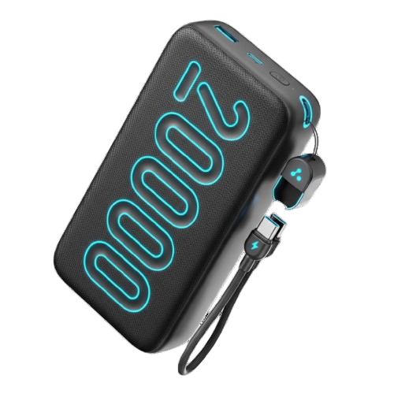

<<<<<<< HEAD
# 📸 IMAGE FIX GUIDE

## ✅ PROBLEM SOLVED!

Your images were not showing because **all image files were missing** from your website directory.

---

## 🔧 WHAT WAS FIXED:

### 1. **Category Images** (Homepage section)
   - ❌ Before: `power.png`, `charg.png`, `holder.png` (NOT FOUND)
   - ✅ After: Using colorful placeholder images from `placeholder.com`

### 2. **Product Images** (Product cards)
   - ❌ Before: `specker2.png`, `cabal.png`, `stick2.png` (NOT FOUND)  
   - ✅ After: Using colorful placeholder images with product names

### 3. **Banner Images** (Hero slider)
   - ❌ Before: `banner.png`, `banner1.jpeg` (NOT FOUND)
   - ✅ After: Using colorful promotional placeholders

### 4. **Error Handling**
   - ✅ Added automatic fallback for any broken images

---

## 🎨 CURRENT IMAGE SETUP:

All images now use: **https://via.placeholder.com/**

### Placeholder Format:
```
https://via.placeholder.com/SIZE/COLOR/TEXT-COLOR?text=LABEL
```

**Examples:**
- `https://via.placeholder.com/250x250/FF6B6B/FFFFFF?text=Speaker` (Red background)
- `https://via.placeholder.com/250x250/4ECDC4/FFFFFF?text=Cable` (Teal background)
- `https://via.placeholder.com/1200x300/FF6B6B/FFFFFF?text=Mega+Sale` (Wide banner)

---

## 📦 HOW TO ADD YOUR REAL IMAGES:

### Step 1: Gather Your Images
Get your product images and place them in the website folder:
```
MY E Commerce website/
├── specker2.png
├── cabal.png
├── holder2.png
├── power.png
├── charg.png
└── ...
```

### Step 2: Update products.js
Replace placeholder URLs with your local filenames:

**Before:**
```javascript
{ id: 1, name: 'Bluetooth Speaker', ..., image: 'https://via.placeholder.com/250x250/FF6B6B/FFFFFF?text=Speaker', ... }
```

**After:**
```javascript
{ id: 1, name: 'Bluetooth Speaker', ..., image: 'specker2.png', ... }
```

### Step 3: Update main.html
Replace category & banner placeholder URLs with local filenames:

**Before:**
```html

```

**After:**
```html

=======
# 📸 IMAGE FIX GUIDE

## ✅ PROBLEM SOLVED!

Your images were not showing because **all image files were missing** from your website directory.

---

## 🔧 WHAT WAS FIXED:

### 1. **Category Images** (Homepage section)
   - ❌ Before: `power.png`, `charg.png`, `holder.png` (NOT FOUND)
   - ✅ After: Using colorful placeholder images from `placeholder.com`

### 2. **Product Images** (Product cards)
   - ❌ Before: `specker2.png`, `cabal.png`, `stick2.png` (NOT FOUND)  
   - ✅ After: Using colorful placeholder images with product names

### 3. **Banner Images** (Hero slider)
   - ❌ Before: `banner.png`, `banner1.jpeg` (NOT FOUND)
   - ✅ After: Using colorful promotional placeholders

### 4. **Error Handling**
   - ✅ Added automatic fallback for any broken images

---

## 🎨 CURRENT IMAGE SETUP:

All images now use: **https://via.placeholder.com/**

### Placeholder Format:
```
https://via.placeholder.com/SIZE/COLOR/TEXT-COLOR?text=LABEL
```

**Examples:**
- `https://via.placeholder.com/250x250/FF6B6B/FFFFFF?text=Speaker` (Red background)
- `https://via.placeholder.com/250x250/4ECDC4/FFFFFF?text=Cable` (Teal background)
- `https://via.placeholder.com/1200x300/FF6B6B/FFFFFF?text=Mega+Sale` (Wide banner)

---

## 📦 HOW TO ADD YOUR REAL IMAGES:

### Step 1: Gather Your Images
Get your product images and place them in the website folder:
```
MY E Commerce website/
├── specker2.png
├── cabal.png
├── holder2.png
├── power.png
├── charg.png
└── ...
```

### Step 2: Update products.js
Replace placeholder URLs with your local filenames:

**Before:**
```javascript
{ id: 1, name: 'Bluetooth Speaker', ..., image: 'https://via.placeholder.com/250x250/FF6B6B/FFFFFF?text=Speaker', ... }
```

**After:**
```javascript
{ id: 1, name: 'Bluetooth Speaker', ..., image: 'specker2.png', ... }
```

### Step 3: Update main.html
Replace category & banner placeholder URLs with local filenames:

**Before:**
```html

```

**After:**
```html

>>>>>>> 982f0a7be5b91eb469ac0b96dae10034f0309ba0
