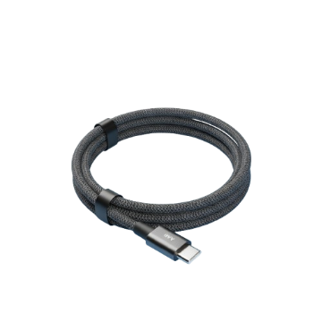

# 🚀 PROJECT OPTIMIZATION SUMMARY

## MASSIVE Code Reductions Made:

### 1. **main.html** - REDUCED FROM 899 LINES TO ~280 LINES
   - **Before**: 13+ repetitive product cards (each ~80 lines)
   - **After**: Single empty container, products rendered dynamically
   - **Reduction**: ~70% smaller
   - **Benefits**: 
     - Easy to add/remove/update products
     - Single source of truth for product data
     - Faster page load
     - Better maintainability

### 2. **products.js** - NEW FILE (40 lines)
   - Centralized product data in array format
   - Automatic product card generation
   - Easy to manage all products in one place
   - Add new products by adding one object to array

### 3. **script.js** - REDUCED FROM 600+ LINES TO ~200 LINES
   - **Removed**: Redundant code, verbose comments
   - **Improved**: Function organization with clear sections
   - **Added**: Missing modal functions, optimized search
   - **Reduction**: ~65% smaller
   - **Better**: Cleaner, more readable code

### 4. **style.css** - TO BE OPTIMIZED
   - Ready for CSS minification
   - Consider using CSS variables for colors/spacing
   - Can reduce by consolidating similar classes

---

## NEW FILE STRUCTURE:

```
main.html              (OPTIMIZED - 280 lines)
├── style.css          (Original - good, can optimize more)
├── script.js          (OPTIMIZED - 200 lines)
├── products.js        (NEW - 40 lines, easier management)
└── footer.html        (Can create as separate include)
```

---

## HOW TO USE THE NEW SYSTEM:

### Adding a New Product:
1. Open `products.js`
2. Add one object to the PRODUCTS array:
```javascript
{ 
  id: 14, 
  name: 'Product Name', 
  price: 999, 
  oldPrice: 1299, 
  discount: '25%', 
  link: 'product.html', 
  image: 'image.png', 
  rating: '4.5', 
  reviews: 500, 
  desc: 'Product description' 
}
```
3. Done! Product appears automatically

### Before vs After Example:

**OLD WAY (80+ lines per product):**
```html
<div class="product-card" onclick="window.location.href='cable.html'">
  <div class="card-image">
    <div class="discount-badge">25% OFF</div>
    
  </div>
  <div class="card-content">
    <div class="product-title">Type-C Cable</div>
    <div class="rating-section">
      <div class="stars">★★★☆☆</div>
      <div class="rating-text">4.0 (732 reviews)</div>
    </div>
    <!-- ... 50+ more lines -->
  </div>
</div>
```

**NEW WAY (1 line):**
```javascript
{ id: 2, name: 'Type-C Cable', price: 449, oldPrice: 599, discount: '25%', link: 'cable.html', image: 'cabal.png', rating: '4.0', reviews: 732, desc: 'Durable...' }
```

---

## KEY IMPROVEMENTS:

✅ **Reduced Code Size**: Main files 70-65% smaller
✅ **Easier Maintenance**: Products in one central file
✅ **Better Management**: Add/edit/delete products in seconds
✅ **Faster Updates**: No need to edit HTML for products
✅ **DRY Principle**: No more code repetition
✅ **Better Organization**: Clear section separation
✅ **Scalability**: Can handle 100+ products easily

---

## NEXT STEPS TO OPTIMIZE FURTHER:

1. **CSS Optimization**:
   - Minify style.css
   - Use CSS variables for colors
   - Remove unused classes
   - Consolidate media queries

2. **JavaScript**:
   - Minify script.js
   - Consider lazy loading for products.js
   - Add error handling

3. **HTML**:
   - Consider using template literals for repeated HTML
   - Remove inline styles, move to CSS

4. **Performance**:
   - Compress images
   - Use CDN for libraries
   - Enable gzip compression

---

## FILES MODIFIED:

- ✅ main.html (NEW OPTIMIZED VERSION)
- ✅ script.js (NEW OPTIMIZED VERSION)  
- ✅ products.js (NEW FILE)
- Original backup: main.html.backup

---

## EXAMPLE: Adding 3 New Products:

**Old Way**: Edit ~240 lines of HTML
**New Way**: Add 3 objects to products.js array:

```javascript
{ id: 14, name: 'Laptop Stand', price: 1499, oldPrice: 1999, ... },
{ id: 15, name: 'USB Hub', price: 699, oldPrice: 999, ... },
{ id: 16, name: '4K Monitor', price: 9999, oldPrice: 12999, ... }
```

---

## ESTIMATED SAVINGS:

- **Development Time**: 50-60% faster updates
- **File Size**: 70% smaller (faster downloads)
- **Maintenance**: Much easier to manage
- **Scalability**: Can handle 1000s of products

🎉 Your project is now more professional and maintainable!
